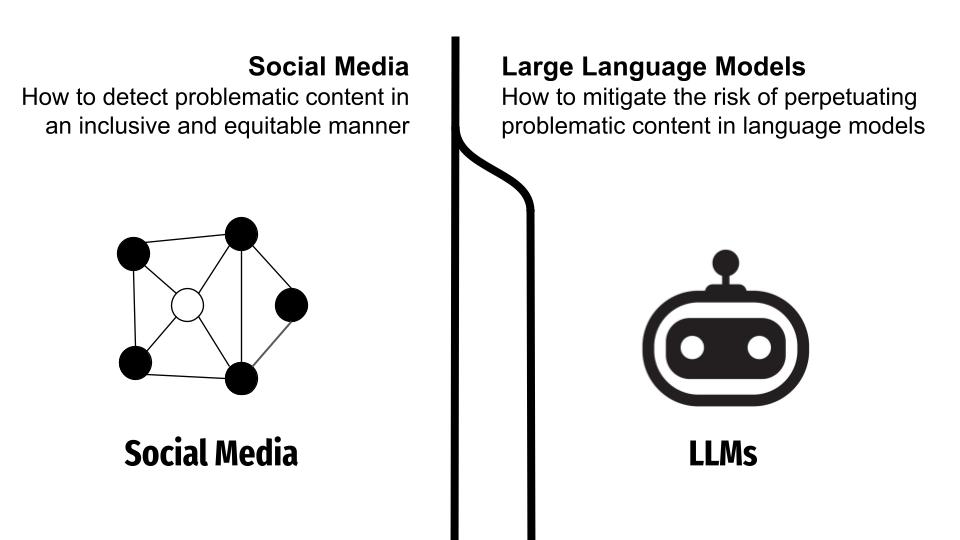
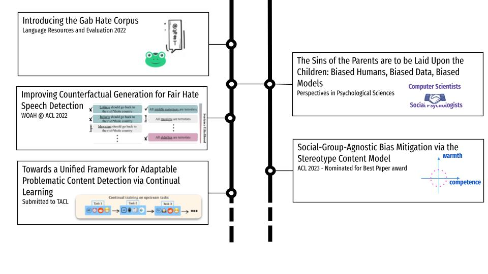

I'm a Senior Machine Learning Engineer and Tech Lead at Snap Inc., where I lead research and development on advertiser understanding, personalization, and AI-driven recommendations. I completed my Ph.D. in Computer Science at the University of Southern California (USC), where I was a member of the Morality and Language Laboratory (MOLA) advised by Prof. Morteza Dehghani.

My research focuses on the design, evaluation, and safety of large language 
models and agentic AI systems. I'm particularly interested in the gap between 
how these systems perform in controlled settings and how they behave when 
deployed at scale, where data is noisy, user intent is ambiguous, and failure 
modes are hard to anticipate from benchmarks alone.

Most recently, I've been building production agentic systems at Snap: 
advertiser understanding pipelines, hybrid search and segmentation at scale, 
and LLM evaluation infrastructure including shadow launch frameworks and 
active learning loops for continuous model improvement. This work has 
shaped how I think about evaluation as a research problem, not just 
measuring models, but designing the feedback systems that make improvement 
possible in deployment.

My PhD work adds a complementary lens: I studied how social context shapes 
what AI systems get wrong, publishing on bias mitigation, hate speech 
detection, and content moderation at ACL, NAACL, and Cognition. I view robustness and safety not as 
post-hoc patches, but as properties that have to be designed in from 
the problem formulation stage.

The research questions I'm most excited about now sit at the intersection 
of these two threads: how do we evaluate agentic systems rigorously? How 
do we detect and correct model failures in production without ground truth? 
And how do social and contextual factors shape the failure modes that matter 
most?

  
  

**At Snap**, I've built and shipped systems across several research-adjacent domains. As Tech Lead for Advertiser Understanding and Personalization, I spearheaded agentic advertiser profiling, segmentation, and hybrid search systems that serve as core infrastructure for recommendations, fraud detection, and campaign creation at scale. I also developed a multimodal AI system that converts ad images, video, and audio into structured representations using large multimodal model, now the backbone for fraud detection, creative discovery, and content classification across Snap's ads platform. On the research side, I designed a novel human-in-the-loop pipeline for fraud trend detection [Under Review].

**During my Ph.D.**, my research focused on mitigating problematic content in the digital realm — addressing bias in NLP models, hate speech detection, and dynamic content adaptation. I published at ACL, NAACL, Cognition, and Scientific Reports, with one paper nominated for Best Paper at ACL 2023 (top 1.6%). I also interned twice at Snap, contributing to identity graph modeling and ad content classification systems that were both adopted in production.

**Before USC**, I completed my B.Sc. in Computer Engineering at the University of Tehran, where I built a foundation across math, systems, and ML. I did research at the Data Science Lab analyzing call data records from Iran's largest mobile operators, spent a summer at Fraunhofer IDMT in Germany working on deep learning for Music Information Retrieval (funded by a DAAD scholarship), and completed my thesis on attention mechanisms in medical decision support systems at the Cognitive Systems Lab — winning the Best Thesis Award. I was also affiliated with RoboCup Asia-Pacific (RCAP) 2018 and attended Allameh Helli High School under NODET.