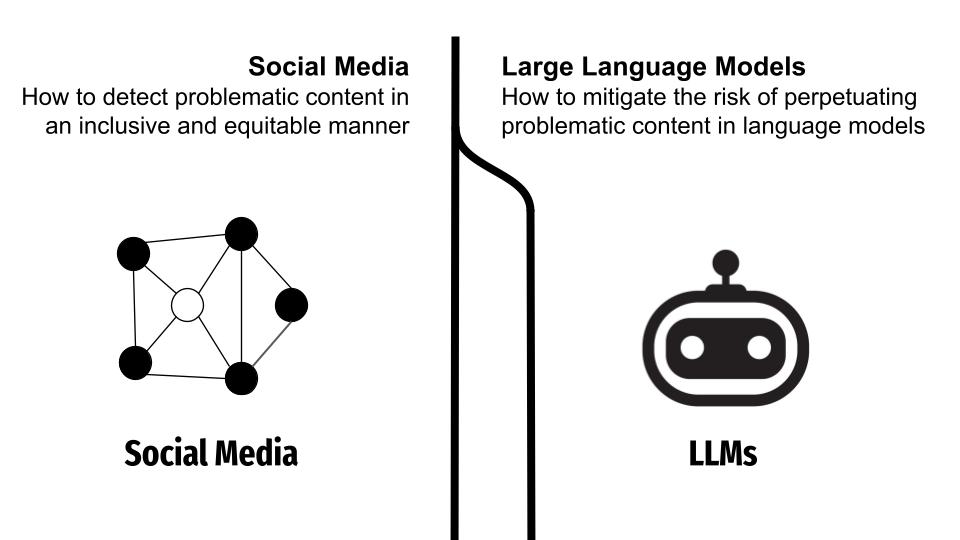

 I am a Ph.D. candidate at the Computer Science Department of University of Southern California (USC) where I am a member of the Morality and Language Laboratory (MOLA), advised by Prof. Morteza Dehghani. 

I strive to understand machine learning pipelines in the context of the larger socio-technical system they're embedded into. My research has predominantly focused on mitigating problematic content in the digital realm. I've addressed diverse technical challenges to reduce online problematic content, whether it stems from human users or machine-generated models. A core component of my work is acknowledging the societal roots of this issue by advocating for and pursuing approaches informed by social science theories. 

  
  

<!-- Specifically, I'm interested in understanding and mitigating the unwanted effects of dataset biases on downstream machine learning applications. I'm also interested in applying machine learning for social scientific purposes. My research often involves building NLP solutions motivated by a social psychological research question to gain insight into our online behavior. -->

Prior to MOLA, I finished my B.Sc. in computer engineering (majoring in software) at the Department of Electrical and Computer Engineering, University of Tehran in August 2019. I tried to use my bachelor's to build a solid bedrock for my future research. So in addition to taking many optional graduate-level courses on math and computer science, I started by investigating the Call Data Records of Iran’s top mobile operators at the Data Science Laboratory at the University of Tehran as a keen freshman. Then, trying to stay at the edge of research, I spent the 2017 summer at Fraunhofer IDMT in Germany researching on the applications of Deep Learning to Music Information Retrieval. After Fraunhofer, following my passion to better understand human behavior, I spent a year as a Research Assistant at the Cognitive Systems Laboratory at the University of Tehran where I compeleted my thesis on utilizing attention mechansim in neural networks and won the Best Thesis Award for it.

During my bachelors, I was also affiliated with RoboCup Asia-Pacific (RCAP) 2018, a super-regional headquarter representing the RoboCup Federation, coordinating RoboCup activities in the Asia Pacific region. Before joining University of Tehran, I was a high school student at the Allameh Helli Highschool which is affiliated with NODET.
